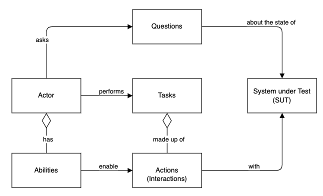

* Guide: Understand [Screenplay Pattern](https://www.npmjs.com/package/@testla/screenplay)



## Definine action

```typescript

import { Action } from '@testla/screenplay';class Navigate extends Action {

private readonly url: string;private constructor(url: string) {
    super();
    this.url = url;
}

// the actual implementation of the action
public performAs(actor: Actor): Promiseany {
    return MyBrowseAbility.as(actor).navigate(this.url);
}

// static member method to invoke the action
public static to(url: string): Navigate {
    return new Navigate(url);
}
private constructor(url: string) {
    super();
    this.url = url;
}

// the actual implementation of the action
public performAs(actor: Actor): Promiseany {
    return MyBrowseAbility.as(actor).navigate(this.url);
}

// static member method to invoke the action
public static to(url: string): Navigate {
    return new Navigate(url);
}
}
```

## Define a task

```typescript
import { Task } from '@testla/screenplay';

class Login extends Task {
    // the actual implementation of the task
    public async performAs(actor: Actor): Promise<any> {
        return actor.attemptsTo(
            Navigate.to('https://www.my-fancy-url.com'),
            Fill.with('#username', actor.username || ''),
            Fill.with('#password', actor.password || ''),
            Click.on('#login-button'),
        );
    }

    // static member method to invoke the task
    public static toApp(): Login {
        return new Login();
    }
}
```

## Define a question

```typescript
import { Question } from '@testla/screenplay';

class LoginStatus extends Question<any> {
    // the actual implementation of the task
    public async answeredBy(actor: Actor): Promise<any> {
        return BrowseTheWeb.as(actor).find('#logged-in-indicator');
    }

    // static member method to invoke the question
    public static of() {
        return new LoginStatus();
    }
}
```

## Define a screen

```typescript

export class LogInScreen {
    static USERNAME_TEXTBOX = `[id="username"]`;
    static PASSWORD_TEXTBOX = '[id="password"]';
    static SUBMIT_BUTTON = '[class="radius"]';
}
```

## Define a test case

```typescript
import { Actor } from "@testla/screenplay";

// Example test case with Playwright
test.describe('My Test', () => {
    test('My first test', async ({ page }) => {
        const actor = Actor.named('James')
            .with('username', 'John Doe')
            .with('password', 'MySecretPassword');
            .can(MyBrowseAbility.using(page));

        await actor.attemptsTo(Login.toApp());

        expect(await actor.asks(LoginStatus.of())).not.toBeNull();
    });
});
```
